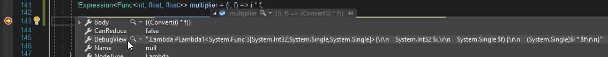
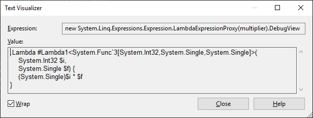
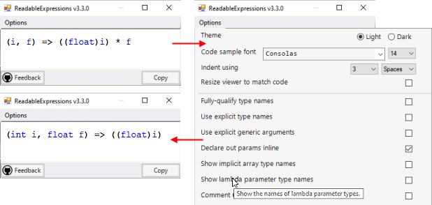
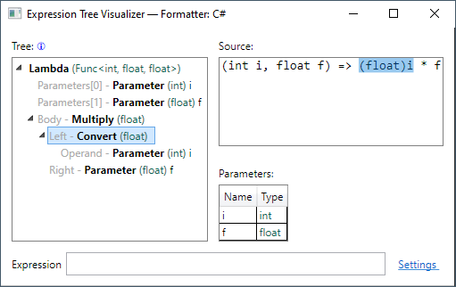
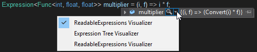

# Gỡ lỗi expression tree (cây biểu thức) trong Visual Studio

Bạn có thể phân tích cấu trúc và nội dung của expression tree khi gỡ lỗi ứng dụng của mình. Để có cái nhìn tổng quan nhanh về cấu trúc của expression tree, bạn có thể sử dụng thuộc tính `DebugView`, thuộc tính này biểu diễn expression tree [bằng một cú pháp đặc biệt](debugview-syntax.md). `DebugView` chỉ khả dụng trong chế độ debug.

Vì `DebugView` là một chuỗi (string), bạn có thể sử dụng [Trình trực quan hoá chuỗi tích hợp sẵn](/visualstudio/debugger/view-strings-visualizer#open-a-string-visualizer) để xem nó trên nhiều dòng, bằng cách chọn **Text Visualizer** từ biểu tượng kính lúp bên cạnh nhãn `DebugView`.

Ngoài ra, bạn có thể cài đặt và sử dụng [một trình trực quan hoá tuỳ chỉnh](/visualstudio/debugger/create-custom-visualizers-of-data) cho expression tree, chẳng hạn như:

- [Readable Expressions](https://github.com/agileobjects/ReadableExpressions) ([giấy phép MIT](https://github.com/agileobjects/ReadableExpressions/blob/master/LICENCE.md), có sẵn trên [Visual Studio Marketplace](https://marketplace.visualstudio.com/items?itemName=vs-publisher-1232914.ReadableExpressionsVisualizers)), hiển thị expression tree dưới dạng mã C# có thể tuỳ chỉnh giao diện, với nhiều tuỳ chọn hiển thị khác nhau:

  

- [Expression Tree Visualizer](https://github.com/zspitz/ExpressionTreeVisualizer/blob/master/README.md) ([giấy phép MIT](https://github.com/zspitz/ExpressionTreeVisualizer/blob/master/LICENSE)) cung cấp chế độ xem dạng cây của expression tree và từng nút riêng lẻ:

## Mở trình trực quan hoá cho expression tree

Chọn biểu tượng kính lúp xuất hiện bên cạnh expression tree trong **DataTips**, cửa sổ **Watch**, cửa sổ **Autos**, hoặc cửa sổ **Locals**. Một danh sách các trình trực quan hoá có sẵn sẽ được hiển thị:

Chọn trình trực quan hoá bạn muốn sử dụng.

## Xem thêm

- [Gỡ lỗi trong Visual Studio](/visualstudio/debugger/debugger-feature-tour)
- [Tạo Trình trực quan hoá tuỳ chỉnh](/visualstudio/debugger/create-custom-visualizers-of-data)
- [Cú pháp `DebugView`](debugview-syntax.md)
